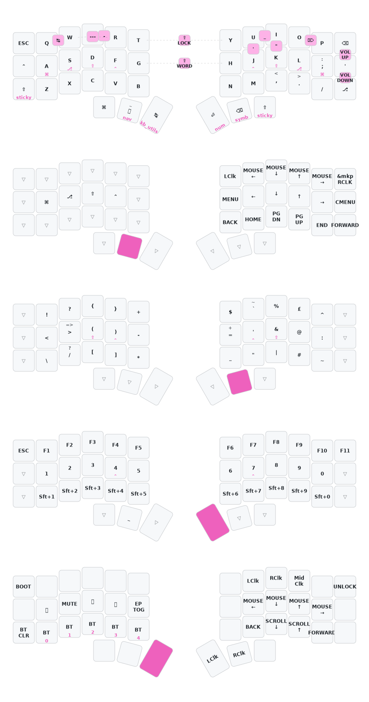

# thrly's ZMK configuration

This config is for a 6-col corne (wireless version from [Typeractive](https://typeractive.xyz/)), but I've consolidated to a 36-key 5col board I designed myself: [TEMPEST](https://github.com/thrly/tempest). This layout makes that transition very easy.

> For more explanations and reflections on this customization, see [my blog post](https://thrly.com/blog/thoughts-on-customising-a-split-keyboard-layout/) on this keymap.

## Key Features

- QWERTY alpha layout
- Homerow mods ([balanced flavour](https://zmk.dev/docs/keymaps/behaviors/hold-tap#option-3-balanced)) - `Gui-Alt-Shf-Ctl`
- Sticky shift
- Mouse behavior on Nav layer
- Horizontal Num layer
- Thumb keys transparent on layers (for `Ctrl` and `Shift`)
- `Shift` morphs `Space` to `_`. Useful for `TYPING_CAPS_VARIABLES`
- Combos:
  - volume up / down (outer right top + middle / middle + bottom)
  - caps word / caps lock (`G`+`J` / `T`+`Y`)
  - escape (`Q`+`W`)
  - delete (`O`+`P`)
  - dash, underscore (`E`+`R`, `U`+`I`) 
  - single quotes, double quotes (`U`+`J`, `I`+`J`) 
- Macros:
  - double-tap `>` for `=>` arrow
  - en-dash (` -- `) combo (`W`+`E`+`R`)
  - `console.log(` combo (`Q`+`R`+`U`+`P`) via an AutoHotkey macro set to `F19` : `F19:: send "console.log("`
> [!IMPORTANT]
> Home Row Mods are now standard.

## Layers

Drawn with [Keymap-Drawer](https://github.com/caksoylar/keymap-drawer)

## Other

- https://github.com/M165437/nice-view-gem - This is purely aesthetic and gives some more user feedback on the nice!view displays.

## Notes

- Configure keymap with https://nickcoutsos.github.io/keymap-editor/
- Flash firmware from latest 'Actions' artifact
